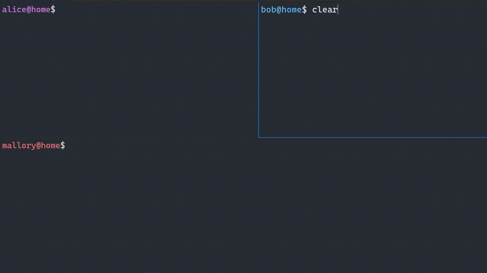

# _isogencrypt_

C library for isogeny-based cryptographic research. 

Project **_isogencrypt_** was developed as a part of the master's thesis: _"Post-quantum cryptography protocols based on isogenies"_ at Adam Mickiewicz University in Poznan. Large part of the research was conducted under _Study@Research_ grant from the "IDUB" program.


> [!WARNING]  
> _isogencrypt_ is a cryptographic research library for testing speed and efficiency of a low-level isogeny-based algorithms implementations. It is an uncertified, not production-ready cryptographic software and at this state - **should not be used as a mature software security component**.

## 🔒 1.  Cryptographic Overview 

_isogencrypt_ was designed as a research-oriented library. It aims to provide low-level and faster equivalent to the SageMath's elliptic curve interface, especially the part often used in isogeny-based cryptographic constructions. Currently, the library implements following key-exchange protocols:

* **M-SIDH Protocol** from [M-SIDH and MD-SIDH: countering SIDH attacks by masking information](https://ia.cr/2023/013) by Tako Boris Fouotsa, Tomoki Moriya and Christophe Petit.
* **TerSIDH Protocol** from [New SIDH Countermeasures for a More Efficient Key Exchange](https://ia.cr/2023/791) by Andrea Basso and Tako Boris Fouotsa.

Finite field arithmetic is built on top of multi-precision integer `mpz` type from [GMP library](https://gmplib.org/), which allows to conduct experiments with aribtrary-length parameters. This bottom layer can be later replaced with the fixed-size integer arithmetic to further increase the speedup, without modifying the interface of the upper layers.

Elliptic curve and isogeny algorithms are implemented using _Montgomery $x$-only Arithmetic_, representing point coordinate $x$ in projective form $x = (X : Z)$ and curve coefficients in projective _xDBL_ form: $(a + 2)/4 = (A_{24+}: C_{24})$. Some of the used algorithms are can be found in following publications:

* [Towards quantum-resistant cryptosystems from supersingular elliptic curve isogenies](https://ia.cr/2011/506) by Luca De Feo, David Jao, and Jérôme Plût.
* [Montgomery curves and their arithmetic: The case of large characteristic fields](https://ia.cr/2017/212) by Craig Costello and Benjamin Smith.
* [A simple and compact algorithm for SIDH with arbitrary degree isogenies](https://ia.cr/2017/504) by Craig Costello and Huseyin Hisil. 
* [Computing isogenies between Montgomery curves using the action of (0,0)](https://ia.cr/2017/1198) by Joost Renes.


## 🔗 2. Dependencies

### 2.1 GMP

_isogencrypt_ C core is based on [GMP](https://gmplib.org/) - *The GNU Multiple Precision Arithmetic Library* - this is the only dependency required to **use** the library code. On Debian Linux systems it its included in `libgmp-dev` package and can be installed with `apt`. For guidance how to install GMP from source, refer to the [GMP installation docs](https://gmplib.org/manual/Installing-GMP).

```bash
# Install GMP package with include data and shared lib
sudo apt install libgmp-dev
```

### 2.2 OpenSSL

_isogencrypt_ core library does not use anything from OpenSSL, but the included `example` demo depends on `openssl` AES and HKDF implementation. To successfully compile example demo target, OpenSSL `libssl-dev` library is required to be present on the system.

```bash
# Install OpenSSL package with the include data and shared lib
sudo apt install libssl-dev
```

### 2.3 SageMath

This dependency is **not required** to successfully run any of the available _isogencrypt_ C code. However, the repository contains auxiliary SageMath package (`isogencrypt_sage`) which was used to produce static assets, benchmarks and verification data. Refer to [SageMath Section](#3-sagemath-package) for more information.


## 🚀 3. Quickstart 

Currently 3 main executable `Makefile` targets are supported: `example`, `tests` and `benches` (grouped together under common and default `all` target). Additionally 2 automated integration targets are available: `run-tests` and `run-diffs`.

```bash
# Build "example", "tests" and "benches" targets
$ make
```

### 🧪 3.1 Tests

Correctness of the implementation is tested in a 2 distinct ways: 

1. **Unit tests** for each of the core isogeny algorithms 
2. **Diff tests** against test vectors prepared using SageMath

Unit tests source files are located under `tests` directory, and each `.c` source file is a stand-alone binary executable compiled inside `build/tests` directory. To compile the tests type `make tests`, and `make run-tests` to execute all of them at once.

```bash
# Compile the test executables
$ make tests

# Run all Unit Tests under ./build/tests
$ make run-tests
------------------------------------
> Run: test_ec_mont
------------------------------------
[+] Ok: tests/test_ec_mont.c::test_point_set_is_immutable()
[+] Ok: tests/test_ec_mont.c::test_A_A24p_conversion_in_place()
...
[+] Ok: tests/test_ec_mont.c::test_j_invariant()
[+] Ok: All tests passed: tests/test_ec_mont.c
```

Each of the `run-tests` pass creates `.out` files, that store the output from last unit tests execution. They are formatted in the same way that allows for **verification** of program results by running similar calculations in well-known and credible software (such as SageMath). Calculated **test vectors** are located in `assets` directory. To run the checks against all test outputs with corresponding test vector in assets, use `make run-diffs` target.

```bash
# Compare the outputs from Unit Tests with output given by SageMath 'verify' scripts
$ make run-diffs
Check diff: test_ec_mont.diff (PASSED)
Check diff: test_isog_mont.diff (PASSED)
Check diff: test_proto_msidh.diff (PASSED)
Check diff: test_proto_tersidh.diff (PASSED)
```

Diffs are stored inside `build/out/diffs` for troubleshooting if needed. 

### 📊 3.2 Benches

Main purpose of **isogencrypt** is to test the efficiency of low-level implementation of the isogeny-based cryptographic protocols. For this purpose `bench` executable targets are created (found in `benches` directory). Each benchmark code is required to print a **valid** `.tsv` data on the `stdout` during computation (`stderr` can be used for diagnostic information).  Benchmark targets can be compiled with `make benches` target. 

```bash
# Compile the benchmark executables in `benches` directory
$ make benches
```

It is highly recommended to launch benchmarks with `stdout` redirection to some `results.tsv` file.

```bash
$ ./build/benches/bench_proto_msidh > results.tsv
[1/24][t=10][1/5]: took 0.012118 seconds to execute
[1/24][t=10][2/5]: took 0.013160 seconds to execute
[1/24][t=10][3/5]: took 0.012796 seconds to execute
[1/24][t=10][4/5]: took 0.012954 seconds to execute
...
```

Generated static benchmark data is stored in `assets` directory. Additional benchmarks can be generated with `sage` scripts, refer to [SageMath Package](#3-sagemath-package) for more.

### 🔐 3.3 Example

In order to see possible integration and future deployment of the protocols inside **isogencrypt**, a proof-of-concept demo of the **M-SIDH Handshake** (see: [Cryptographic Overview](#-1--cryptographic-overview)) is available in `example` folder. Inside 2 executables (`isog_server` and `isog_client`) are located, which allow `isog_client` to send encrypted data over the network using socket interface to `isog_server` which will print the decrypted messages. 

```bash
# Compile 'isog_client' and 'isog_server' 
# Require -lssl and -lcrypto to be available (see: Dependencies)
$ make example

# Listen on port 9999 for the connection and decrypt traffic
$ ./build/example/isog_server 127.0.0.1 9999

# [In another terminal]
# Connect to the listening server and send encrypted traffic
$ ./build/example/isog_client 127.0.0.1 9999
```

Short recording shows the example usage of the executables*:



*Video uses aliases for calling `isog_server` and `isog_client` on localhost port 9999. "Mallory" executes the `tcpdump` tool to show plaintext content of exchanged tcp traffic going from alice to bob (only one-way).

## 4. SageMath Package

Detailed specification of the `isogencrypt_sage` python package, can be found in [sage](./sage/README.md) directory. Below is a short summary of what was done in order to generate the available static assets.

> [!NOTE]
> SageMath is built on top of Python, but it is not fully compatible - there are many ways to launch sage code with python and python code with sage, but each can have its own weird quirks. For simplicity the recommended setup is to add `./sage` to `PYTHONPATH` to allow importing `isogencrypt_sage` in every called `.sage` script and run scripts with `sage -python`. Refer to package README for more details. 

### 4.1 Generate Test Vectors 

Test vectors located in `assets` directory were created using:

```bash
# Find all .py verifiers in './sage/verifiers' dir, run them with sage
# and store result in './assets/test_vectors/<filename>.out, replacing 'verify' with 'test'
$ find ./sage/verifiers -type f -name 'verify*.py' -exec sh -c 'sage -python "$1" > "./assets/test_vectors/$(basename "$1" | sed "s/^verify_\(.\+\)\.py$/test_\1.out/")"' _ {} \;
```

Each of the test vectors can be also regenerated separately.

```bash
$ sage -python ./sage/verifiers/verify_ec_mont.py > ./assets/test_vectors/test_ec_mont.out
$ sage -python ./sage/verifiers/verify_isog_mont.py > ./assets/test_vectors/test_isog_mont.out
...
$ sage -python ./sage/verifiers/verify_proto_msidh.py  > ./assets/test_vectors/test_proto_msidh.out
```

### 4.2 Generate Benchmark Tasks

Benchmark tasks for MSIDH in `.json` format and were created using:

```bash
# Generate Bench tasks for t in range(10, 241, 10)
$ sage ./sage/scripts/gen_msidh_bt.sage -o ./assets/bench_tasks/bt_msidh.json -i 10 -e 241 -s 10
# Convert bench tasks into .c code 
$ sage ./sage/scripts/conv_msidh_bt.sage ./assets/bench_tasks/bt_msidh.json
```

